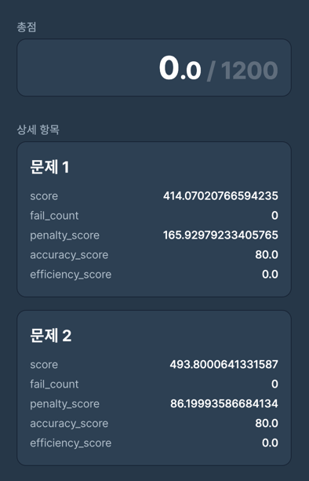

# 파이썬도 배워볼겸 하는 카카오 2차 과제

현재 점수 (2023 06 26) [best fit + 방 할당 미루기]
문제 1번 : {"accuracy_score":80.0,"efficiency_score":0.0,"penalty_score":165.92979233405765,"score":414.07020766594235}
문제 2번 : {"accuracy_score":80.0,"efficiency_score":0.0,"penalty_score":86.19993586684134,"score":493.8000641331587}

근데 제출하니까 총점이 이렇게 보인다... why? ㅋㅋㅋㅋ

